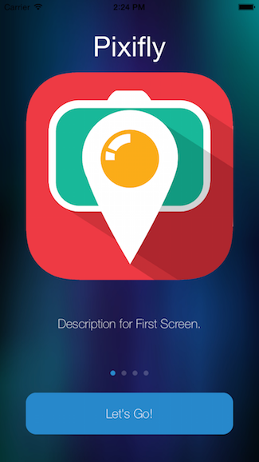
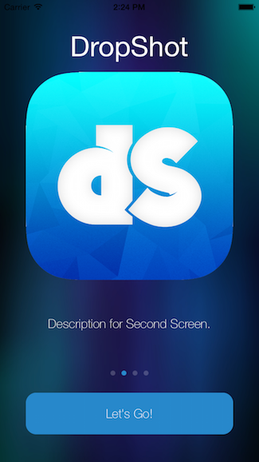
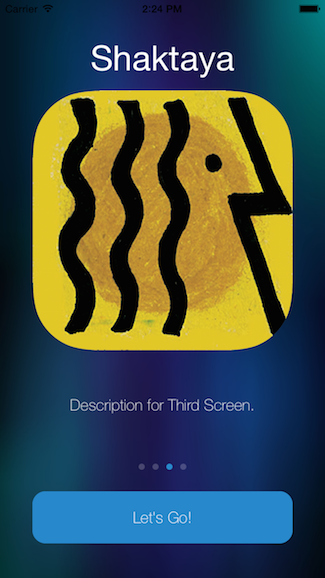
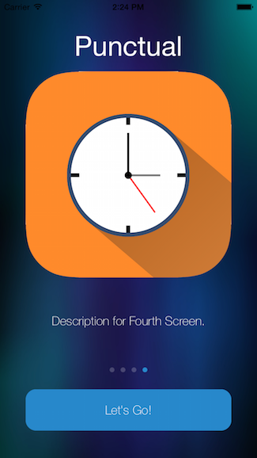

ABCIntroView
========================
ABCIntroView is an easy to use onboarding which allows you to introduce your users to the applicaiton before reaching the Main Screen.






To use the ABCIntroView please do the following:

1. Add the follwing files found in the CLASSES folder to your project:
```
        *ABCIntroView.h
        *ABCIntroView.m
```

2. Import the ABCIntoView file to your RootViewController.

3. Create an ABCIntroView property and add the ABCIntroViewDelegate.

4. Add the following line of code to your ViewDidLoad:
```
    NSUserDefaults *defaults = [NSUserDefaults standardUserDefaults];
    if (![defaults objectForKey:@"intro_screen_viewed"]) {
        self.introView = [[ABCIntroView alloc] initWithFrame:self.view.frame];
        self.introView.delegate = self;
        self.introView.backgroundColor = [UIColor greenColor];
        [self.view addSubview:self.introView];  
    }
```

5. Add the ABCIntroView Delegate Method:
```
#pragma mark - ABCIntroViewDelegate Methods

-(void)onDoneButtonPressed{
    //    Uncomment so that the IntroView does not show after the user clicks "DONE"
    //    NSUserDefaults *defaults = [NSUserDefaults standardUserDefaults]
    //    [defaults setObject:@"YES"forKey:@"intro_screen_viewed"];
    //    [defaults synchronize];
    [UIView animateWithDuration:1.0 delay:0 options:UIViewAnimationOptionCurveEaseInOut animations:^{
        self.introView.alpha = 0;
    } completion:^(BOOL finished) {
        [self.introView removeFromSuperview];
    }];
}
```

If you have any questions about the project, please don't hesitate to ask.

Enjoy! :)

Adam
